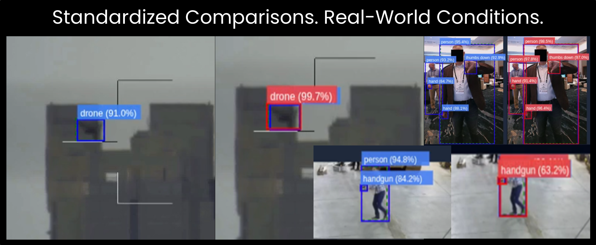
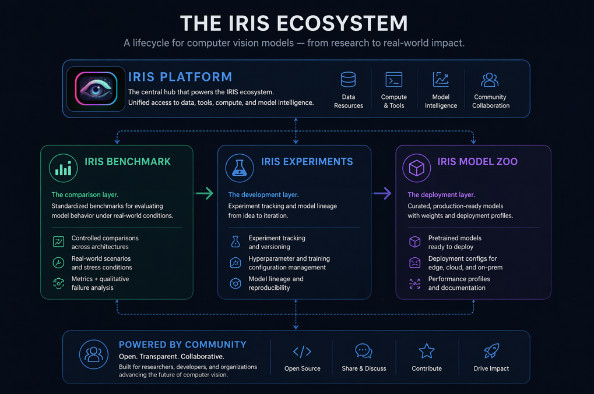

<!-- ===================================================== -->
<!--                     HEADER                            -->
<!-- ===================================================== -->

<h1 align="center">IRIS Benchmarks</h1>

  <strong>Standardized Comparisons. Real-World Conditions.</strong>

  Controlled evaluation of computer vision models under consistent, real-world scenarios.

  <a href="#featured-benchmarks">Explore Benchmarks</a> •
  <a href="#methodology">Methodology</a> •
  <a href="#how-this-fits-into-iris">Ecosystem</a>

---

  

---

<!-- ===================================================== -->
<!--                     BADGES                            -->
<!-- ===================================================== -->

  
  
  
  

---

<!-- ===================================================== -->
<!--                 WHAT THIS IS                          -->
<!-- ===================================================== -->

## What This Repository Is

This repository is the **comparison layer** of the IRIS ecosystem.

It exists to evaluate how computer vision models behave under:
- consistent training and validation conditions  
- real-world environmental variability  
- operationally relevant constraints  

This is not a collection of isolated results.

It is a structured system for understanding **model behavior across conditions**.

---

<!-- ===================================================== -->
<!--                 WHY IT EXISTS                         -->
<!-- ===================================================== -->

## Why This Exists

Most model evaluations optimize for a score. They do not show how models behave when conditions change.

They do not answer:
- how models behave under distance and scale
- how performance shifts in cluttered environments
- where failure modes actually emerge

IRIS Benchmark focuses on:
- **behavior, not just metrics**
- **consistency, not just peak performance**
- **comparability across architectures**

---

<!-- ===================================================== -->
<!--               FEATURED BENCHMARKS                     -->
<!-- ===================================================== -->

## Featured Benchmarks

<table>
  <tr>
    <th>Benchmark</th>
    <th>Domain</th>
    <th>Focus</th>
    <th>Architectures</th>
    <th>Link</th>
  </tr>
  <tr>
    <td><strong>Anti-UAV EO</strong></td>
    <td>Drone Detection</td>
    <td>Small / distant object detection</td>
    <td>YOLO, RT-DETR, Faster R-CNN</td>
    <td><a href="[#](https://github.com/iris-computer-vision/iris-benchmark-drone-eo)">View</a></td>
  </tr>
</table>

---

<!-- ===================================================== -->
<!--                VISUAL COMPARISON                      -->
<!-- ===================================================== -->

## What These Benchmarks Show
These comparisons show how model behavior diverges under real-world conditions.

  

Top: A distant object is missed entirely by one model (Faster R-CNN) despite being present and detected by another (YOLOv8s).  
Bottom: A higher-confidence detection (RT-DETR) introduces duplicate predictions on the same target.

These are not edge cases. They are common outcomes that do not surface in aggregate metrics.

Performance is not just about score. It is about how models fail. 

---

<!-- ===================================================== -->
<!--                 METHODOLOGY                           -->
<!-- ===================================================== -->

## Methodology

Benchmarks in IRIS are designed for **controlled comparison**, not isolated results.

Each evaluation is structured to ensure that differences in performance reflect model behavior, not experimental variance.

---

### Standardization

All models are evaluated under aligned conditions:

- consistent dataset splits  
- uniform preprocessing pipelines  
- comparable training configurations where applicable  

This ensures that differences in output are attributable to the model itself.

---

### Evaluation

Performance is measured using standard metrics:

- mAP (mean Average Precision)  
- mAR (mean Average Recall)  
- IoU (Intersection over Union)  

These provide a baseline for comparison across architectures.

---

<strong>Why Metrics Alone Are Not Enough</strong>

Traditional metrics provide frame-level evaluation.

They do not capture:
- persistence across sequences  
- sensitivity to environmental change  
- real-world failure behavior  

IRIS Benchmark pairs quantitative metrics with qualitative evaluation to provide a more complete picture of model performance.

---

## How This Fits Into IRIS

IRIS is structured as a lifecycle for understanding and deploying computer vision systems.

**Flow:**

- **Benchmark** → compare model behavior under controlled, real-world conditions  
- **Experiments** → explore how models behave across changing conditions, domains, and definitions  
- **Model Zoo** → deploy models designed and trained using the IRIS platform

  

## Related Repositories

- **IRIS Model Zoo**  
  Released models with weights and deployment profiles  
  → [[ModelZoo](https://github.com/iris-computer-vision/iris-model-zoo/)]

- **IRIS Experiments**  
  Experiment lineage and model evolution  
  → [[Experiments](https://github.com/iris-computer-vision/iris-experiments/)]

---

## External Resources

Check out the [IRIS](https://iriscomputervision.ai/) webpage for all the latest news and updates!
- Hugging Face Models → [[HF](https://huggingface.co/IRIS-Computer-Vision/models)] 
- Case Studies → [[Here](https://iriscomputervision.ai/case-studies/)]

---

  <strong>IRIS is built for lifecycle-driven computer vision.</strong>

